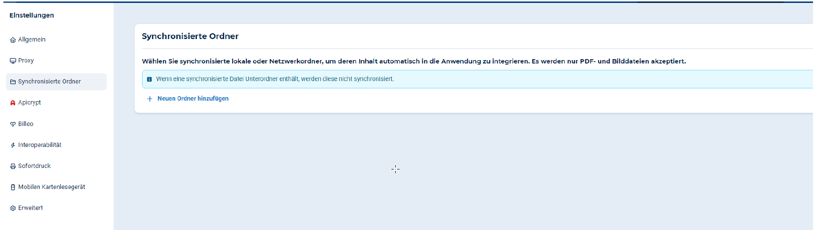

# GDT Anbindung 
**Reminder: Feature switch drin? (support-medical devices)**  

**1. GDT EXPORT - Auftrag aus Patientenakte an GDT Gerät senden**  
1. In DL Einstellungen - erweiterte EInstellungen - Geräteintegration & Verbindung  

 

2. Wähle “Verbindung erstellen” und “GDT Export” (Export meint hier den Auftrag aus DL ans Gerät zu senden)  
3. Name und Herstellername hinzufügen ( 
- Name zB “EKG oben”
- Gerätetyp: Wenn Gerät nicht dabei ist, ein anderen Typ auswählen 
- Marke: auch individueller Text möglich, sollte Marke im Dropdown nicht erscheinen  

4. Erstellen Sie Ihre GDT-Exporteinstellungen 
- Dateiname zb test.gdt 
- Ordnerpfad - aus den Eigenschaften des Speicherordners den Pfad kopieren   
- Zeichensatz  
- Untersuchungsgruppe und Untersuchungscode eindeutig für dieses Gerät einstellen  
- Unten auf Erstellen klicken 

**2. GDT IMPORT - Auftrag aus verbundenen Gerät abholen**  
1. In DDV Einstellungen gehen (Burgermenü - Datei - Einstellungen - Synchronisierter Ordner  

2. Neuen Ordner hinzufügen (Achtung, dies ist ein zu erstellender Ordner in dem die PDF Befunde des GDT Geräts abgespeichert werden sollen) 
2. Ordnerpfad eingeben  

