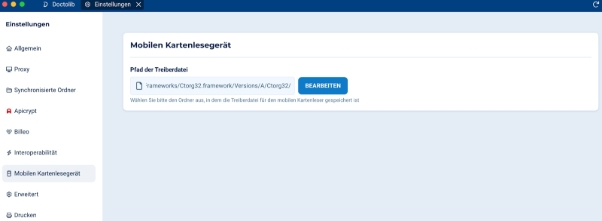

### **Mobile Kartenterminals Zweck** 
Mobile Kartenterminals (Mobile Card Reader, MCR) emulieren stationäre Kartenterminals, funktionieren jedoch ohne ständige Netzwerkverbindung. Sie ermöglichen das Auslesen von Gesundheitskarten, zum Beispiel bei einem Hausbesuch durch medizinisches Fachpersonal. So können abrechnungsrelevante Versicherungsdaten direkt vor Ort beim Patienten eingelesen, auf dem Gerät gespeichert und später in das Praxisverwaltungssystem (PVS) übertragen werden. Dadurch ist gewährleistet, dass die Informationen aktuell sind und ein Abrechnungsfall angelegt werden kann. 
![ref1]
### **Details** 
Diese Geräte werden regelmäßig über USB oder Bluetooth mit dem PVS verbunden, um Daten zu übertragen. Es werden zwei Arten von Gesundheitskarten unterstützt: eGK (elektronische Gesundheitskarte) und KVK (Krankenversichertenkarte). 

Aktuell unterstützte mobile Kartenterminals: 

- **Ingenico (Worldline) Orga 930 Care** 
- **Ingenico (Worldline) Orga 930 M Online** 
- **Cherry ST-1530
![ref1]**
### **Einrichtung** 
1. **Installieren Sie den vom Hersteller bereitgestellten Treiber:** 
- **Ingenico / Worldline Kartenleser:** 

  [ Software & Treiber | Worldline Deutschland ](https://www.worldline.com)

- **Cherry Kartenleser:** 

  [ Downloads | CHERRY Service - Cherry](https://www.cherry.de)** 

2. **Treiber lokalisieren und konfigurieren:** 
- Der Pfad hängt vom Betriebssystem und ggf. von benutzerdefinierten Installationspfaden ab. Merken Sie sich den Pfad – er wird im nächsten Schritt in den DDV-Einstellungen benötigt. 

**Typische Pfade unter Windows:** 

**Marke**  **Standard-Installationspfad** 

Ingenico /  C:\Program Files (x86)\Ingenico 

Worldline  Healthcare\ORGA\_6000\Tools\Ctorg32\_4\_developer\x64\CTORG64.lib 

Cherry  C:\Program Files 

ST-1530  (x86)\CHERRY\ST1530\Tools\Ctorg32\_4\_developer\x64\CTORG64.lib 

` `**Typische Pfade unter macOS:** 

**Marke**  **Standard-Installationspfad** 

Ingenico /  /Library/Frameworks/Ctorg32.framework/Versions/Current/Ctorg3 Worldline  2 

Cherry ST-1530  /Library/Frameworks/Ctorg32.framework/Versions/Current/Ctorg3

2 

` `**Nur für macOS: Führen Sie folgenden Befehl aus:** 

sudo chown -R $(whoami):staff /Library/Frameworks/Ctorg32.framework/Versions/Current/ 

3. **Konfiguration in DDV** 

**Wichtig: Der mobile Kartenleser darf zu Beginn der Konfiguration NICHT angeschlossen sein!** 

1. Öffnen Sie DDV und melden Sie sich mit einem Account an, der ein EHR-DE-Abonnement hat. 
1. Gehen Sie zu **DDV Einstellungen → Mobiler Kartenleser** 
1. Geben Sie den Pfad zur Treiberdatei an 
1. Schließen Sie die DDV-Einstellungen 
1. Schließen Sie jetzt den mobilen Kartenleser an
![ref1]
### **Einschränkungen** 
Die Treiber für mobile Kartenleser sind veraltet und werden nicht regelmäßig aktualisiert. Sie unterstützen keine modernen Systeme, insbesondere nicht die ARM64-Architektur auf Mac-Geräten. In der Praxis bedeutet das: **Apple-Geräte ohne Intel-Prozessor können keine Daten mit einem mobilen Kartenleser auslesen.** 

[ref1]:images/ASPOSE~1.PNG

