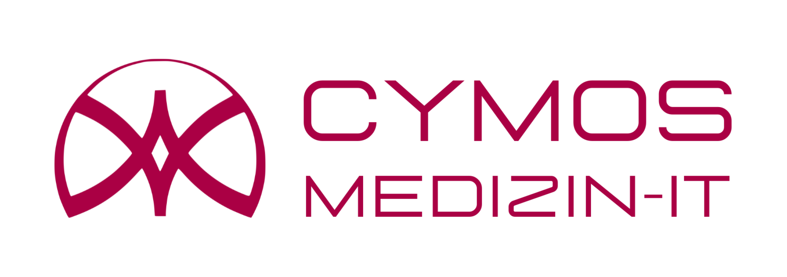

**Abschlussprüfung Sommer 2025** \
**Fachinformatiker/- in Systemintegration**       **Dokumentation zur betrieblichen Projektarbeit** 

Thema: 

Implementierung und Integration eines digitalen  Terminplanungssystems in bestehende IT-Infrastruktur 

Durchführungszeitraum: 07.04.2025 – 25.04.2025 

Projekt wurde durchgeführt von: Thilakzan Thilakan \
Albert-Schweitzer-Straße 2      63454 Hanau Mittelbuchen 

Ausbildungsbetrieb: CYMOS Medizin IT      Rathausstraße 30 – 36 61184 Karben 

Implementierung und Integration eines digitalen  Terminplanungssystems in bestehende IT-Infrastruktur 

Inhaltsverzeichnis 

[1  Projektbeschreibung ........................................................................... 3 ](#_page2_x68.00_y70.92)

1.1 [Ist – Zustand .............................................................................. 3 ](#_page2_x68.00_y103.92)

1.2 [Soll – Zustand ............................................................................. 3 ](#_page2_x68.00_y317.92)

[2  Projektplanung .................................................................................. 4 ](#_page3_x68.00_y70.92)

[2.1  Zeitplanung ................................................................................ 4 ](#_page3_x68.00_y96.92)

[3  Datenschutz, IT-Sicherheit und rechtliche Anforderungen ......................... 4 ](#_page3_x68.00_y418.92)

3.1 [Datenschutz und DSGVO-Konformität ............................................. 4 ](#_page3_x68.00_y456.92)

3.2 [Zertifizierungen & gesetzliche Anforderungen (BSI, KBV) ................... 5 ](#_page4_x68.00_y119.92)

[4  Projektdurchführung ........................................................................... 5 ](#_page4_x68.00_y668.92)

4.1 [Vorbereitung und Abstimmung mit der Praxis ................................... 5 ](#_page4_x68.00_y697.92)

4.2 [Technische Planung und Integration in die Praxisinfrastruktur ............. 6 ](#_page5_x68.00_y279.92)

4.3 [Einrichten der Geräte und Dienste .................................................. 6 ](#_page5_x68.00_y431.92)

4.3.1 [Firewall-Konfiguration & Webfilter................................................ 6 ](#_page5_x68.00_y455.92)

4.3.2 [Einrichtung der Testumgebung und Installation der Anwendungen .... 8 ](#_page7_x68.00_y523.92)

4.3.3 [Einrichtung und Konfiguration in Doctolib...................................... 9 ](#_page8_x68.00_y368.92)

4.3.4 [Datenmigration: Export aus Medical Office und Import in Doctolib .. 12 ](#_page11_x68.00_y70.92)

4.4 [Rollout der Doctolib-Software im Praxisnetzwerk ............................. 13 ](#_page12_x68.00_y360.92)

[4.4.1  Softwareverteilung mit automatischer Konnektor-Einrichtung ......... 13 ](#_page12_x68.00_y384.92)

4.5 [Abschlussphase: Tests, Schulung und Live-Betrieb .......................... 13 ](#_page12_x68.00_y624.92)
   
4.5.1 [Testphase und Ergebnis ........................................................... 13 ](#_page12_x68.00_y648.92)

4.5.2 [Erstellung einer praxisindividuellen Anleitung .............................. 14 ](#_page13_x68.00_y125.92)

4.5.3 [Go-Live mit Vor-Ort-Betreuung und Schulung .............................. 14 ](#_page13_x68.00_y457.92)

[5  Projektabschluss .............................................................................. 15 ](#_page14_x68.00_y70.92)

5.1 [Auswertung der Zeitplanung ........................................................ 15 ](#_page14_x68.00_y96.92)

5.2 [Nutzwertanalyse: Doctolib vs. physikalischer Praxisplaner ................ 15 ](#_page14_x68.00_y458.92)

5.3 [Fazit ........................................................................................ 16 ](#_page15_x68.00_y199.92)

[6  Anhang .......................................................................................... 17 ](#_page16_x68.00_y70.92)

6.1 [Glossar .................................................................................... 17 ](#_page16_x68.00_y96.92)

6.2 [Übersicht der freizugebenden Domains für Doctolib ......................... 17 ](#_page16_x68.00_y492.92)
 
6.3 [Quellenverzeichnis ..................................................................... 19 ](#_page18_x68.00_y70.92)

Seite  von 19 

1  Projektbeschreibung 

1. Ist – Zustand 

   Im Rahmen meiner Abschlussprüfung zum Fachinformatiker für Systemin- tegration habe ich bei CYMOS Medizin IT ein Projekt zur Digitalisierung der Terminplanung in einer medizinischen Praxis durchgeführt. Ziel war die Ein- führung der Software Doctolib, um die Terminvergabe effizienter, transpa- renter und zeitsparender zu gestalten. Die Praxis vergab Termine bislang ausschließlich telefonisch oder persönlich, was zu hoher Belastung, langen Wartezeiten und häufigen Doppelbuchungen führte. Eine Online-Buchung oder automatische Terminerinnerungen gab es nicht, wodurch viele Termine ungenutzt blieben. 

2. Soll – Zustand  

   Durch die Einführung der digitalen Terminverwaltungssoftware Doctolib soll die Terminplanung vollständig digitalisiert werden. Ziel ist es, dass Patienten ihre Termine eigenständig online buchen, verwalten oder absagen können. Gleichzeitig soll das Praxispersonal entlastet und die Anzahl der versäumten Termine durch automatische Erinnerungen reduziert werden. Die Integration in das bestehende Arztinformationssystem gewährleistet eine durchgängige und datenschutzkonforme Verarbeitung aller Termindaten. 

2  Projektplanung 

2.1  Zeitplanung 

|**Arbeitsschritt**|**Geplanter Zeitaufwand** |
| - | - |
|**Planung** ||
|Analyse der Anforderungen |3,00 h |
|Präsentation der Doctolib-Softwarelösung |2,00 h |
|Abstimmung mit der Praxis und deren Bedürfnissen |2,00 h |
|**Projektdurchführung** ||
|Planung des Ausfalls mit der Praxis |2,00 h |
|Erstellung des Doctolib-Praxiszugangs |2,50 h |
|Datensicherung durchführen |2,00 h |
|Netzwerkkonfiguration und Firewallanpassung |2,00 h |
|Datenmigration & Synchronisation mit Doctolib |2,00 h |
|Datenprüfung nach Migration |2,00 h |
|Testinstallation eines Clients |0,50 h |
|Rollout der Client-Installation |4,00 h |
|Integration ins Arztinformationssystem |1,00 h |
|Testphase & Fehlerbehebung |1,00 h |
|Praxis-spezifische Anleitung erstellen |2,00 h |
|Mitarbeiterschulung |2,00 h |
|Go-Live-Unterstützung |2,00 h |
|**Dokumentation erstellen** ||
|Erstellung der Dokumentation |8,00 h |

3  Datenschutz, IT-Sicherheit und rechtliche Anforderungen 

1. Datenschutz und DSGVO-Konformität 

   Ein zentraler Aspekt bei der Einführung von Doctolib ist die Einhaltung der Datenschutz-Grundverordnung (DSGVO). 

   Doctolib stellt umfangreiche technische und organisatorische Maßnahmen zur Verfügung, um den Anforderungen der DSGVO gerecht zu werden. 

   Insbesondere gewährleistet Doctolib: 

- die Verschlüsselung aller personenbezogenen Daten (Ende-zu-Ende), 
- eine datenminimierte Verarbeitung, 
- sowie die Trennung von medizinischen und organisatorischen Informa- tionen. 

Sowohl Patienten als auch Praxismitarbeiter erhalten transparente Informa- tionen über die Verarbeitung personenbezogener Daten. 

Dazu gehören u. a. Rechte auf Auskunft, Berichtigung, Löschung und Daten- übertragbarkeit. 

2. Zertifizierungen & gesetzliche Anforderungen (BSI, KBV) 

   Zur Sicherstellung von Datenschutz und Datensicherheit erfüllt Doctolib nicht nur die Anforderungen der DSGVO, sondern weist auch nachweislich hohe IT- Sicherheitsstandards auf. 

   BSI C5-Testat: Doctolib wurde vom Bundesamt für Sicherheit in der Informa- tionstechnik (BSI) mit dem C5-Testat (Cloud Computing Compliance Criteria Catalogue) ausgezeichnet. 

   Dieses bestätigt, dass die Cloud-Infrastruktur von Doctolib den höchsten Si- cherheits- und Transparenzanforderungen für Cloud-Dienste entspricht – ein- schließlich Protokollierung, Datensicherung, Schutz vor Angriffen und Notfall- management. 

   ISO 27701-Zertifizierung: Zusätzlich wurde Doctolib von der BSI Group mit der ISO 27701-Zertifizierung ausgezeichnet – einem international anerkann- ten Datenschutzstandard als Erweiterung der ISO 27001. 

   Damit wird bestätigt, dass Doctolib über ein dokumentiertes Datenschutz- Managementsystem verfügt, das auf den Schutz personenbezogener Gesund- heitsdaten ausgerichtet ist. 

   Anforderungen der KBV: Die Kassenärztliche Bundesvereinigung (KBV) defi- niert konkrete Anforderungen die u. a. Datenschutz, Verfügbarkeit und Be- nutzerfreundlichkeit betreffen. 

   Doctolib erfüllt diese Anforderungen und ist damit für den Einsatz in medizi- nischen Einrichtungen zugelassen. 

   Diese Übereinstimmung unterstützt die rechtssichere und praxistaugliche In- tegration in bestehende medizinische IT-Strukturen. 

4  Projektdurchführung 

4.1 Vorbereitung und Abstimmung mit der Praxis 

   Zur Einführung des Projekts wurde der Praxisleitung und der Praxismanagerin die Softwarelösung Doctolib in einer Präsentation vorgestellt. Diese umfasste die grundlegenden Funktionen der Plattform, Vorteile der Online-Termin- vergabe, datenschutzrechtliche Aspekte sowie die geplante Integration in das Arztinformationssystem Medical Office. Ziel war es, ein klares Verständnis für den Systemwechsel zu schaffen und mögliche Fragen direkt zu klären. Nach der Freigabe durch die Praxisleitung folgte eine detaillierte Abstimmung mit allen Beteiligten, bei der unter anderem Anforderungen an die Benutzerfüh- rung, Terminarten, Praxisabläufe und technische Rahmenbedingungen defi- niert wurden. Die Ergebnisse dieser Abstimmung flossen direkt in die spätere Konfiguration der Plattform und die Schulung der Mitarbeitenden ein, was eine hohe Akzeptanz im Praxisalltag ermöglichte. 

4.2 Technische Planung und Integration in die Praxisinfrastruktur 

   Zunächst wurden die technischen Anforderungen in Zusammenarbeit mit der Praxis abgestimmt. Dies beinhaltete die Planung eines geeigneten Zeitfens- ters für die Implementierung, ohne den laufenden Praxisbetrieb zu stören. Die bestehende Netzwerkinfrastruktur wurde auf Kompatibilität mit den Doc- tolib-Anforderungen überprüft und die notwendigen Anpassungen, insbeson- dere an der Firewall vorgenommen. 

4.3 Einrichten der Geräte und Dienste 

4.3.1 Firewall-Konfiguration & Webfilter 

Für den sicheren Betrieb von Doctolib wurde die Securepoint-Firewall ent- sprechend angepasst. Ziel war es, nur den notwendigen Datenverkehr frei- zugeben und gleichzeitig den Datenschutz sowie die IT-Sicherheit der Praxis zu gewährleisten. Die Konfiguration erfolgte in Abstimmung mit den techni- schen Vorgaben von Doctolib. 

   Folgende Schritte wurden durchgeführt: 

1. Anlegen der Netzwerkobjekte: Für jeden Arbeitsplatz, der auf Doctolib zugreifen soll, wurde ein eigenes Netzwerkobjekt erstellt. So konnte der Zugriff gezielt auf bestimmte Geräte beschränkt werden. 

   

2. Erstellen einer Netzwerkgruppe: Die angelegten Netzwerkobjekte wur- den zu einer Netzwerkgruppe zusammengefasst, um Regeln gruppenba- siert anwenden zu können.  

   

3. Whitelist-Ruleset anlegen: Alle relevanten Doctolib-Domains wurden in einem eigenen Whitelist-Ruleset hinterlegt, das ausschließlich den Zu- griff auf diese Adressen erlaubt. 

   

4. Zuweisung des Rulesets: Das Whitelist-Ruleset wurde der Netzwerk- gruppe zugewiesen, wodurch nur die vorgesehenen Arbeitsplätze Zugriff auf die Plattform erhalten. 

   

5. Abschließende Kontrolle: Zum Abschluss wurde die gesamte Webfilter- Konfiguration überprüft. In der Übersicht sind alle Netzwerkobjekte, die Gruppenstruktur sowie das zugewiesene Ruleset klar ersichtlich. Das er- möglicht eine schnelle Kontrolle und einfache Anpassung bei Bedarf. 

   

   Eine vollständige tabellarische Auflistung aller freizugebenden Domains ist im Anhang unter Punkt 6.2 enthalten 

4.3.2 Einrichtung der Testumgebung und Installation der Anwendungen Zur Vorbereitung der Migration und für erste Tests wurde eine Windows 11- VM auf einem Hyper-V-Host eingerichtet. Diese Testumgebung diente dazu, den Export und Import von Patientendaten zu simulieren, die Netzwerkkon- figuration zu prüfen und die Anbindung von Doctolib risikolos zu testen – inklusive Webfilter-Anpassungen an der Securepoint-Firewall. Die virtuelle Maschine erhielt eine statische IP-Adresse und wurde mit den benötigten Anwendungen ausgestattet: Doctolib für das Terminmanagement und Me- dical Office als bestehendes Arztinformationssystem (AIS) der Praxis. Bei der Installation von Medical Office wurde ein fester Arbeitsplatzname verge- ben, um standortspezifische Einstellungen korrekt zu laden. 

   

   ` `Die Doctolib-Anwendung wurde standardmäßig eingerichtet. Nach der Mig- ration der Patientendaten wird zusätzlich der Doctolib-Konnektor benötigt, um eine automatische Patientenübernahme zwischen Medical Office und Doctolib zu ermöglichen. 

4.3.3 Einrichtung und Konfiguration in Doctolib 

   Nach erfolgreicher technischer Anbindung wurde die Doctolib-Plattform um- fassend an die organisatorischen und medizinischen Anforderungen der Pra- xis angepasst. In enger Abstimmung mit der Praxisleitung und der Praxis- managerin wurden alle relevanten Funktionen eingerichtet und die Benut- zeroberfläche so konfiguriert, dass sie den täglichen Arbeitsabläufen optimal entspricht. 

   Benutzer und Zugriffsrechte: Über den Bereich „Meine Praxis > Benutzer- konten & Zugriffsrechte“ wurden alle notwendigen Benutzerkonten erstellt und mit passenden Rollen wie Verwaltung, Ärzt:innen oder Praxismana- ger:in Versehen. Dadurch wurde sichergestellt, dass jede Person nur Zugriff auf die für sie relevanten Funktionen erhält. 

   

   Kalender und Ressourcen: Anschließend wurden verschiedene Kalenderar- ten erstellt – z. B. für Ärzt:innen, Behandlungsräume oder Geräte – und den jeweiligen Fachbereichen sowie Benutzergruppen zugeordnet. Diese klare Struktur ermöglicht eine differenzierte und übersichtliche Verwaltung von Terminen und Ressourcen. 

   

   Terminarten und Kategorisierung: Die Terminarten wurden praxisindividuell konfiguriert. Dazu gehören Einstellungen wie Name, Dauer, Zielgruppe, Bu- chungsfristen,  Absagefristen  und  automatische  Benachrichtigungen.  Zu- sätzlich wurden sie in Kategorien wie „Beratung“ oder „Folgetermine“ grup- piert, um die Übersichtlichkeit für Patienten und Personal zu verbessern. 

   

   Interne Hinweise und Buchungshinweise: Für das Praxispersonal wurden in- terne Hinweise zu bestimmten Terminarten hinterlegt, die z. B. an Vorberei- tungen oder besondere Abläufe erinnern. Parallel dazu wurden patienten- seitige Hinweise aktiviert, die vor Abschluss der Onlinebuchung angezeigt werden – z. B. zu mitzubringenden Unterlagen oder Ausfallregelungen. 

   

   

   Abfragen und individuelle Buchungsfelder: Zur strukturierten Erfassung re- levanter Informationen wurden Abfragen (z. B. Neu- oder Bestandspati- ent:in) und individuelle Buchungsfelder (z. B. Kontaktdaten, Versicherungs- status) eingebunden. Diese Maßnahmen ermöglichen eine frühzeitige Vor- bereitung und verbessern die Datenqualität. 

   

   Digitale Dokumente: Zur Entlastung der Praxis und besseren Vorbereitung der Patienten wurden Formulare wie Anamnesebögen oder Aufklärungsun- terlagen digital über Doctolib bereitgestellt. Patient:innen erhalten diese au- tomatisch mit der Terminbestätigung und können sie im Vorfeld ausfüllen. 

   Nachrichten und Terminmitteilungen: Die Nachrichtenfunktion wurde konfi- guriert, aber noch nicht freigeschaltet. Sie soll künftig den strukturierten Austausch zwischen Patienten und Praxis ermöglichen. Zudem wurden au- tomatisierte Terminmitteilungen per E-Mail und SMS aktiviert, um die Ter- mintreue zu verbessern und Ausfälle zu minimieren. 

   

4.3.4 Datenmigration: Export aus Medical Office und Import in Doctolib 

Nachdem Im Rahmen der Datenmigration wurden die vorhandenen Patien- tendaten aus dem bestehenden Arztinformationssystem Medical Office expor- tiert und anschließend in Doctolib importiert. 

Export der Patientendaten: Auf der zuvor eingerichteten Windows 11-VM wurde mithilfe des integrierten Tools MED95BDT ein vollständiger Datenex- port im standardisierten BDT-Format durchgeführt. Dabei wurden alle Pati- enten mit Nummern im Bereich von 1 bis 1122409 und im Zeitraum vom 01.01.2024 bis 21.04.2025 erfasst. Exportiert wurden die Stammdaten (Pa- tienten-ID,  Vorname,  Nachname,  Geburtsdatum).  Als  Exportverzeichnis wurde C:\\_CYMOS\MoExport definiert. Nach Start des Vorgangs bestätigte eine Statusmeldung die laufende Übertragung. Die exportierten Daten lagen danach strukturiert im Zielverzeichnis für den Import bereit. 

Import in Doctolib: Der Import erfolgte über das Administrationsportal von Doctolib. Dort wurde der Dateityp „Patienten“ ausgewählt und die zuvor er- stellte Datei MoExport\_PatStamm.bdt hochgeladen. Als exportierendes Sys- tem wurde Medical Office angegeben, damit das Format korrekt erkannt und verarbeitet  werden  konnte.  Nach  dem  Upload  wurde  der  Import  über 

„Hochladen“ gestartet. Optional konnten im Kommentarfeld Informationen für das interne Team hinterlegt werden.  

Diese Migration bildete die Grundlage für den erfolgreichen Abgleich der Pa- tientendaten zwischen dem Arztinformationssystem (AIS) Medical Office und der Doctolib-Plattform. 

4.4 Rollout der Doctolib-Software im Praxisnetzwerk 

4.4.1 Softwareverteilung mit automatischer Konnektor-Einrichtung 

Die Doctolib-Desktop-Anwendung wurde nach der Testphase über den vor- handenen Remote-Agent zentral auf allen Praxis-PCs verteilt. 

Die automatisierte Installation lief größtenteils reibungslos ab, an einzelnen Arbeitsplätzen kam es jedoch zu Installationsfehlern, die manuell behoben werden mussten. 

Da der Datenimport bereits erfolgreich abgeschlossen war, wird bei der In- stallation nun automatisch der Medical Office-Konnektor mit eingerichtet, um die direkte Anbindung an das AIS sicherzustellen. 

4.5 Abschlussphase: Tests, Schulung und Live-Betrieb 

4.5.1 Testphase und Ergebnis 

   Zur Überprüfung der Systemstabilität und Funktionalität wurden in Doctolib zunächst Testtermine angelegt, verschoben und storniert. Dabei wurde ins- besondere die Kommunikation zwischen Doctolib und dem angebundenen 

   Arztinformationssystem Medical Office überprüft. Auch die automatische Synchronisierung der Daten wurde getestet. 

4.5.2 Erstellung einer praxisindividuellen Anleitung 

   Um Zum Abschluss des Projekts wurde eine speziell auf die Praxis abge- stimmte Anleitung zur Nutzung von Doctolib erstellt. 

   Sie enthält alle relevanten Informationen zu den im Alltag regelmäßig ge- nutzten Funktionen, unter anderem: 

- Terminvergabe und Kalenderübersicht 
- Verwaltung der Patientendaten 
- Umgang mit internen Hinweisen 
- Besonderheiten der konfigurierten Terminarten und Ressourcen 

Die Anleitung wurde verständlich formuliert, praxisnah aufgebaut und auf die tatsächliche Konfiguration der Plattform angepasst. Sie wurde nach der Schulung an die Mitarbeitenden übergeben und zusätzlich im internen Pra- xisnetzwerk zur dauerhaften Verfügung abgelegt. 

4.5.3 Go-Live mit Vor-Ort-Betreuung und Schulung 

   Der Go-Live der Doctolib-Plattform fand planmäßig nach Abschluss aller vor- bereitenden Maßnahmen statt. Zur Unterstützung war ich gemeinsam mit einem Kollegen vor Ort in der Praxis, um das Team beim Echtstart zu be- gleiten. 

   Im Zuge des Go-Live wurde auch die Mitarbeiterschulung direkt durchge- führt: Die Anwender erhielten eine Einführung in die Benutzeroberfläche und führten erste Buchungen unter Anleitung durch. 

   Kleinere Rückfragen – z. B. zur Navigation oder Anzeige von Patientendaten – konnten direkt vor Ort geklärt werden. Die Software funktionierte stabil, und der Wechsel verlief reibungslos und ohne nennenswerte Probleme. 

5  Projektabschluss 

1. Auswertung der Zeitplanung 

|**Arbeitsschritt**|**Geplanter Zeitaufwand** |**Tatsächlicher Zeitaufwand**|
| - | :- | :- |
|**Planung** |||
|Analyse der Anforderungen |3,00 h |2,50 h |
|Präsentation der Doctolib-Softwarelösung |2,00 h |2,50 h |
|Abstimmung mit der Praxis und deren Bedürfnissen |2,00 h |2,00 h |
|**Projektdurchführung** |||
|Planung des Ausfalls mit der Praxis |2,00 h |2,00 h |
|Erstellung des Doctolib-Praxiszugangs |2,50 h |2,50 h |
|Datensicherung durchführen |2,00 h |2,00 h |
|Netzwerkkonfiguration und Firewallanpassung |2,00 h |3,00 h |
|Datenmigration & Synchronisation mit Doctolib |2,00 h |2,00 h |
|Datenprüfung nach Migration |2,00 h |2,00 h |
|Testinstallation eines Clients |0,50 h |0,50 h |
|Rollout der Client-Installation |4,00 h |3,00 h |
|Integration ins Arztinformationssystem |1,00 h |1,00 h |
|Testphase & Fehlerbehebung |1,00 h |1,00 h |
|Praxis-spezifische Anleitung erstellen |2,00 h |2,00 h |
|Mitarbeiterschulung |2,00 h |3,00 h |
|Go-Live-Unterstützung |2,00 h |1,00 h |
|**Dokumentation erstellen** |||
|Erstellung der Dokumentation |8,00 h |8,00 h |

5.2 Nutzwertanalyse: Doctolib vs. physikalischer Praxisplaner 

Zur  weiteren  Bewertung  der  Einführung  von  Doctolib  wurde  eine  Nutz- wertanalyse durchgeführt, die den digitalen Ansatz mit einem klassischen pa- pierbasierten Praxisplaner vergleicht. Dabei wurden praxisrelevante Kriterien gewichtet und beide Systeme bewertet. 

|**Kriterium** |**Gewichtung** |**Doctolib (Punkte)** |**Papier  (Punkte)** |
| - | - | - | :- |
|Benutzerfreundlichkeit |25 % |5 (1,25) |2 (0,5) |
|Terminverfügbarkeit für Patienten |20 % |5 (1,0) |1 (0,2) |
|Fehleranfälligkeit (z. B. Doppelbu- chung) |15 % |5 (0,75) |2 (0,3) |
|Erinnerungsfunktion |10 % |5 (0,5) |1 (0,1) |
|Aufwand für das Personal |15 % |5 (0,75) |2 (0,3) |
|Datenschutz / Zugriffskontrolle |10 % |4 (0,4) |1 (0,1) |
|Skalierbarkeit |5 % |5 (0,25) |1 (0,05) |

Die Nutzwertanalyse zeigt, dass Doctolib dem bisherigen papierbasierten System in allen wesentlichen Kriterien überlegen ist. 

Der einzige Nachteil – die laufenden Lizenzkosten – wird durch die erhebli- chen Vorteile in Erreichbarkeit, Effizienz und Fehlervermeidung deutlich auf- gewogen. 

5.3 Fazit 

   Die Einführung von Doctolib in der Praxis war insgesamt erfolgreich und brachte eine deutliche Verbesserung der Terminvergabeprozesse mit sich. 

   Durch die Online-Buchungsmöglichkeit, automatische Erinnerungen und die strukturierte Datenmigration konnte der Verwaltungsaufwand spürbar redu- ziert und die Patientenzufriedenheit erhöht werden. 

   Die enge Abstimmung mit der Praxisleitung sowie die technische Vorberei- tung – inklusive Firewall-Konfiguration, Benutzerrechtevergabe und zentraler Softwareverteilung – trugen entscheidend zum reibungslosen Ablauf bei. 

   Auch kleinere Probleme bei der Softwareverteilung und im Umgang mit neuen Abläufen konnten dank der Vor-Ort-Betreuung schnell gelöst werden. 

   Das System ist nach dem Go-Live stabil im Einsatz und bietet eine moderne, zukunftssichere Lösung für die digitale Terminorganisation in der Praxis. 

6  Anhang 

6.1 Glossar 

|**Begriff** |**Definition** |
| - | - |
|Doctolib |Online-Terminmanagementplattform für medizinische Praxen. |
|Medical Office |Ein in Arztpraxen verbreitetes Arztinformationssystem (AIS) zur Verwaltung von Patientendaten, Abrechnung, Dokumentation. |
|AIS (Arztinformationssystem) |Zentrale Softwarelösung in medizinischen Einrichtungen zur Verwaltung von Patientendaten, Terminen, Abrechnungen und Dokumentationen. |
|Firewall |Sicherheitssystem zur Filterung des Netzwerkverkehrs. |
|Webfilter |Mechanismus zur Freigabe/Blockierung von Internetinhalten. |
|DSGVO |EU-Datenschutz-Grundverordnung für personenbezogene Da- ten. |
|E2EE |Ende-zu-Ende-Verschlüsselung zur Datensicherheit. |
|Sentry |Dienst zur Fehler- und Ereignisprotokollierung. |
|CDN |Verteilte Serverstruktur zur Inhaltsauslieferung. |
|API |Programmierschnittstelle zur Systemkommunikation. |
|Token |Digitale Authentifizierungs- und Zugangsdaten. |
|Zipper |Doctolib-Komponente zur lokalen Systemintegration. |
|Securepoint |Hersteller von Firewalls und IT-Sicherheitslösungen. |
|BDT (Behandlungsdatenträger) |Ein standardisiertes Format zur strukturierten Übertragung me- dizinischer Patientendaten zwischen Arztinformationssystemen. Wird z. B. für Exporte bei Systemwechseln verwendet. |
|MED95BDT |Ein integriertes Export-Tool innerhalb von Medical Office zur Er- stellung von Patientendaten im BDT-Format. Unterstützt den Ex- port von Stammdaten, Falldaten und Krankenakten für Migrati- onen oder Datenübernahmen. |

6.2 Übersicht der freizugebenden Domains für Doctolib 

   Für  den  reibungslosen  Betrieb  der  Doctolib-Plattform  mussten  in  der Securepoint-Firewall  verschiedene  Domains  und  Subdomains  freigegeben werden. Die folgende Übersicht listet alle relevanten Adressen einschließlich ihrer Kategorien und Einsatzzwecke  

   Aktualisierte vollständige Liste der Domains: 

|**Kategorie** |**Subdomain** |**Einsatzzweck**||
| - | - | - | :- |
|Doctolib Domain |pro.doctolib.de |Doctolib-Terminkalender Deutschland ||
|Doctolib Domain |www.doctolib.de |Patientenplattform Deutschland ||
|Doctolib Domain |www.doctolib.com |Blog, Community, Webinare ||
|Doctolib Domain |doctolib.zendesk.com |FAQ-Seiten ||
|Doctolib Domain |assets.doctolib.fr |Layout- und Formatvorlagen ||
|Doctolib Domain |community.doctolib.com |Zugang zur Community ||
|Doctolib Domain |events-v2.data.doctolib.com |Doctolib-Ereignisse ||
|Doctolib Domain |events-logs.doctolib.com |Doctolib-Ereignisse ||
|Doctolib Domain |dbinsights-production.doctolib.fr |Statistische Auswertungen ||
|Google |fonts.gstatic.com |Inhalt zur Performanceoptimierung ||
|Google |chrome.google.com |Chrome-Erweiterung für Doctolib ||
|Google |content-autofill.googleapis.com |Google Autovervollständigung ||
|Google |www.googletagmanager.com |Tag-Verwaltung ||
|Digicert |oscp.digicert.com |Zertifikatsprüfung ||
|Geotrust |status.geotrust.com |Zertifikatsprüfung ||
|Cloudinary |res.cloudinary.com |Profilbilder ||
|Walkme |cdn.walkme.com |Anleitungen und Pop-ups ||
|Walkme |ec.walkme.com |Anleitungen und Pop-ups ||
|Walkme |papi.walkme.com |Anleitungen und Pop-ups ||
|Walkme |playerserver.walkme.com |Anleitungen und Pop-ups ||
|Intercom |widget.intercom.io |Chatfunktion ||
|Intercom |js.intercomcdn.com |Chatfunktion ||
|Intercom |nexus-websocket-a.intercom.io |Chatfunktion ||
|Intercom |api-iam.intercom.io |Chatfunktion ||
|AWS |doctolib-connector.s3.amazo- naws.com |Zipper-Tool & Doctolib Desktop-Unter- stützung ||
|Tanker |api.tanker.io |Ende-zu-Ende-Verschlüsselungsschlüs- selverwaltung ||
|Sentry |o38419.ingest.sentry.io |Fehler- und Ereignisprotokollierung (Sentry) ||
|Zendesk |cdn.jsdelivr.net |Supportsystem (Zendesk) ||
|Zendesk |p20.zdassets.com |Supportsystem (Zendesk) ||
|Zendesk |secure.gravatar.com |Supportsystem (Zendesk) ||
|Zendesk |static.zdassets.com |Supportsystem (Zendesk) ||
|Zendesk |theme.zdassets.com |Supportsystem (Zendesk) ||
|Zendesk |p4.zdassets.com |Supportsystem (Zendesk) ||
|Didomi.io |sdk.privacy-center.org |Verwaltung von Datenschutzeinstellun- gen ||
|New Relic |bam-cell.nr-data.net |Überwachung (Monitoring) ||
|New Relic |js-agent.newrelic.com |Überwachung (Monitoring) ||
|Embedly |cdn.embedly.com |Content Delivery Netzwerk ||
|Addthis |s7.addthis.com |Marketing / Analyse ||
|Unpkg |unpkg.com |Bereitstellung von JavaScript-Bibliothe- ken ||
|TokBox |anvil.opentok.com |Videotelefonie für Telemedizin ||
|TokBox |config.opentok.com |Videotelefonie für Telemedizin ||
|TokBox |em017-fra.tokbox.com |Videotelefonie für Telemedizin ||
|TokBox |hlg.tokbox.com |Videotelefonie für Telemedizin ||
|Import |doctolib-imports-prd-aws-de-fra- 1.s3.eu-central-1.amazo- naws.com |Datenimport-Funktion ||
|Update |doctolib-pro-desktop-produc- tion.s3.amazonaws.com |Updates für Doctolib Desktop ||

6.3 Quellenverzeichnis 

   Doctolib – Informations- und Supportseiten: 

- [https://www.doctolib.de ](https://www.doctolib.de/) 
- [https://www.doctolib.de/gesundheit/datenschutz ](https://www.doctolib.de/gesundheit/datenschutz) 
- [https://www.doctolib.de/gesundheit/privatsphaere ](https://www.doctolib.de/gesundheit/privatsphaere) 
- [https://info.doctolib.de/datenschutzhinweise ](https://info.doctolib.de/datenschutzhinweise) 
- [https://doctolib.zendesk.com/hc/de/articles/360050440192-So-installie- ren-Sie-die-Doctolib-Desktop-Version ](https://doctolib.zendesk.com/hc/de/articles/360050440192-So-installieren-Sie-die-Doctolib-Desktop-Version) 

Securepoint Firewall – Herstellerinformationen: 

- [https://wiki.securepoint.de ](https://wiki.securepoint.de/) 

Technische Begriffe und Standards/Zertifizierungen 

- Hersteller-Dokumentation zu Medical Office (interne Nutzung, keine URL verfügbar) 
- Dokumentation zur Securepoint UTM-Konfiguration (interne Firewall-Ver- waltung) 
- [https://info.doctolib.de/guides/doctolib-erhaelt-c5-testat-nach-kriterienka- talog-des-bsi/ ](https://info.doctolib.de/guides/doctolib-erhaelt-c5-testat-nach-kriterienkatalog-des-bsi/) 
- [https://about.doctolib.com/news/bsi-group-has-awarded-doctolib-with- the-iso-27701-certification-an-internationally-recognized-standard-for-data- privacy/ ](https://about.doctolib.com/news/bsi-group-has-awarded-doctolib-with-the-iso-27701-certification-an-internationally-recognized-standard-for-data-privacy/)  
- [https://www.kbv.de/html/2024_68453.php ](https://www.kbv.de/html/2024_68453.php) 
Seite **19** von **19**

[ref1]: Aspose.Words.7c6d87ee-763e-47c8-8119-192861a84dcb.003.png

