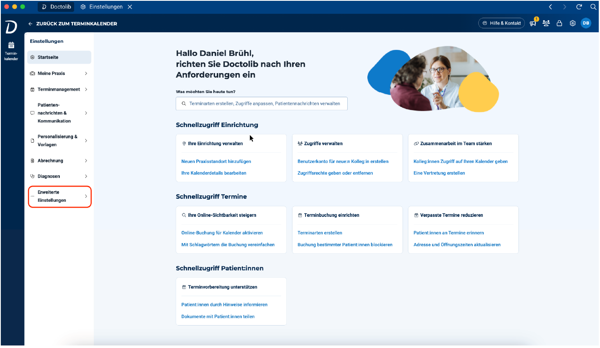
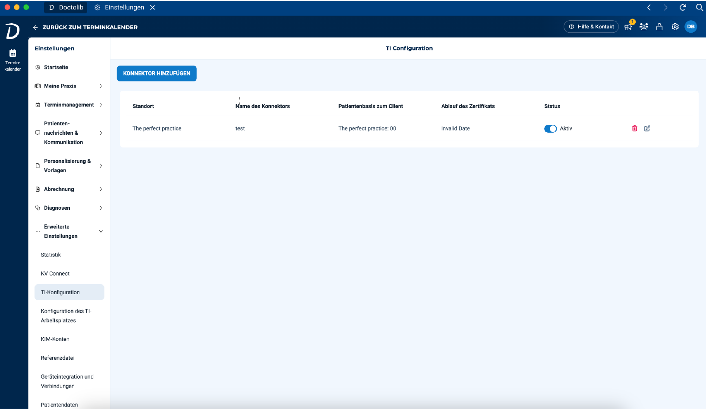
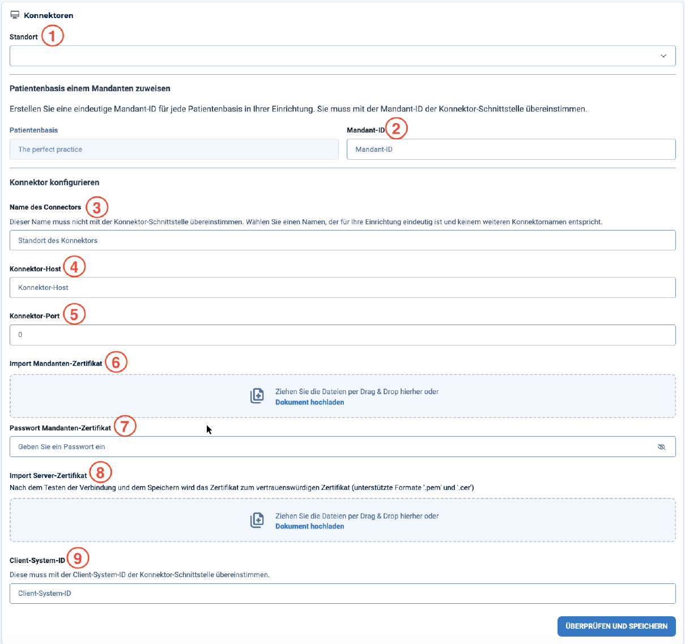
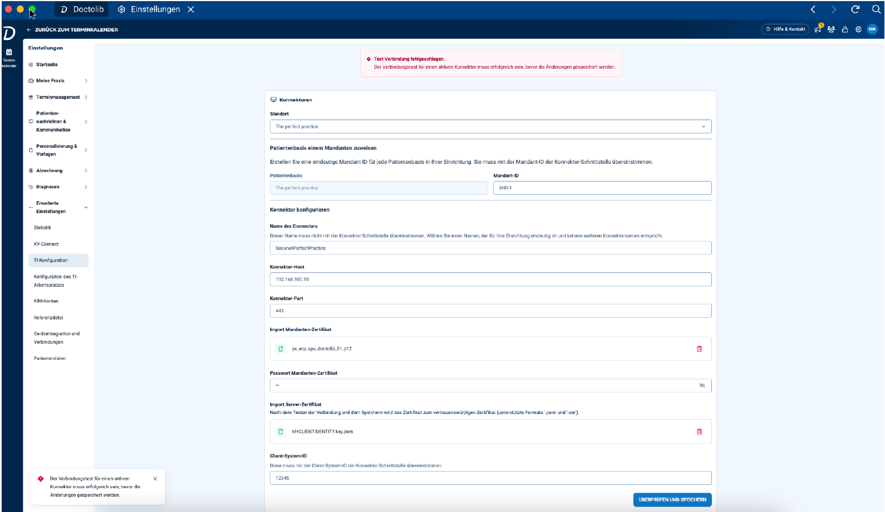
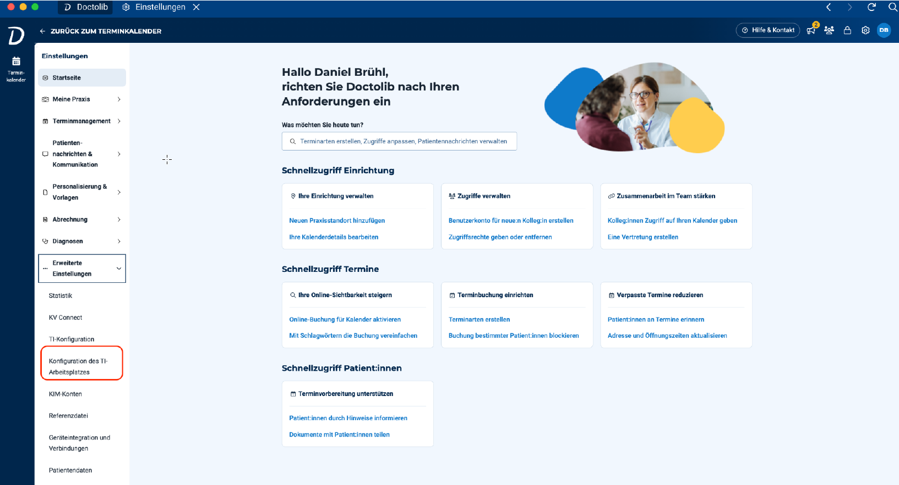
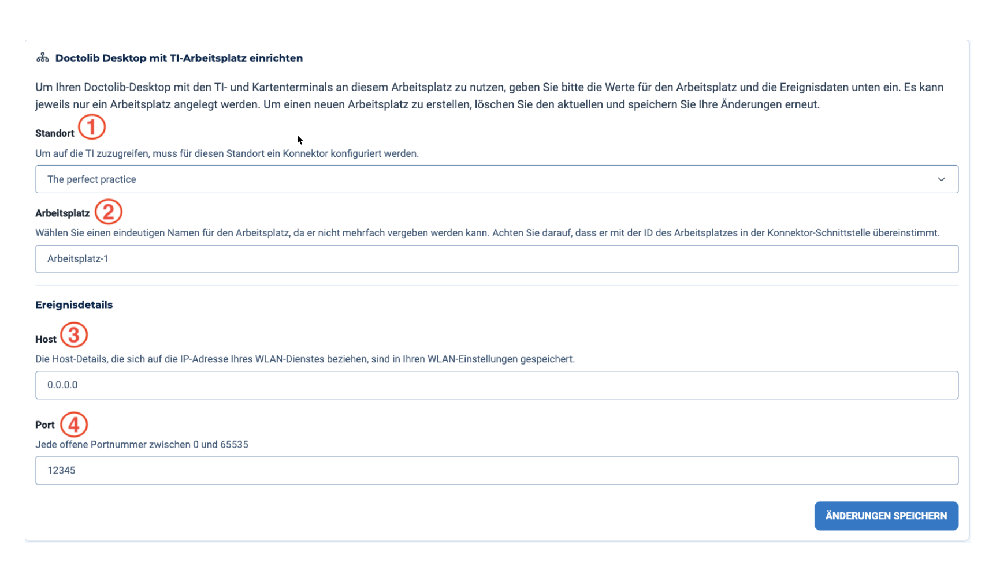

**TI- & Konnektor-Konfiguration** 
### **Was ist die TI?** 
Die **Telematikinfrastruktur (TI)** ist ein sicheres digitales Netzwerk, das den Austausch von Gesundheitsinformationen in Deutschland ermöglicht. Sie bildet das Rückgrat des elektronischen Gesundheitssystems und verbindet Leistungserbringer, Krankenkassen und Patienten, um medizinische Daten effizient und sicher auszutauschen. Die TI integriert verschiedene Komponenten wie die elektronische Gesundheitskarte (eGK), die elektronische Patientenakte (ePA) sowie sichere Kommunikationsdienste (z. B. KIM und TI-Messenger), um sicherzustellen, dass sensible Gesundheitsdaten nur autorisierten Personen zugänglich sind. 

Ziel der TI ist es, die **Versorgungsqualität zu verbessern**, die **Patientensicherheit zu erhöhen** und **Verwaltungsprozesse zu vereinfachen**, indem ein einheitliches System für den Datenaustausch bereitgestellt wird. 

Die Entwicklung der TI ist eine gemeinsame Initiative des Bundesministeriums für Gesundheit, medizinischer Fachverbände und Technologieunternehmen. Sie wurde schrittweise durch die gematik umgesetzt – von Pilotprojekten über die Einführung der eGK (2011) bis hin zum bundesweiten Ausbau von Diensten wie der ePA. Die TI wird kontinuierlich weiterentwickelt, um neue Funktionen zu integrieren und den neuesten technologischen Standards zu entsprechen.

![ref1]

### **Was ermöglicht die TI?** 
Durch eine sichere und standardisierte Plattform für den Austausch medizinischer Informationen ermöglicht die TI eine nahtlose Kommunikation zwischen Leistungserbringern, Krankenkassen und Patienten. Dabei werden höchste Anforderungen an Datenschutz und Datensicherheit erfüllt. 

**Kernfunktionen der TI:** 

- **Elektronische Gesundheitskarte (eGK):** Speichert grundlegende Patientendaten und gewährt Zugriff auf medizinische Informationen. 
- **Elektronische Patientenakte (ePA):** Enthält die gesamte Krankengeschichte eines Patienten und ist für diesen sowie autorisierte Leistungserbringer zugänglich. 
- **KIM & TI-Messenger:** Verschlüsselte Kommunikation zwischen medizinischen Fachkräften. 
- **Elektronisches Rezept (eRezept):** Digitale Ausstellung, Signierung und Versendung von Rezepten. 
- **Telemedizinische Dienste:** Unterstützung von Fernbehandlungen und digitalen Konsultationen. 
- **Verwaltungsvereinfachung:** Automatisierte Prozesse wie Abrechnung und Antragsstellung durch standardisierte digitale Abläufe. 
- **Datenschutz & IT-Sicherheit:** Sicherstellung von Vertraulichkeit, Integrität und Verfügbarkeit der Gesundheitsdaten.

![ref1]
  
### **Wie wird eine Praxis an die TI angeschlossen?** 
Um eine Praxis an die TI anzuschließen, sind folgende Schritte erforderlich: 

1. **Registrierung bei zuständigen Behörden** 
2. **Vertrag mit einem autorisierten IT-Dienstleister (ITSP)** 
3. **Beschaffung und Installation zertifizierter Hardware und Software** 

**Benötigte Komponenten:** 

- **Konnektor:** Sichere Schnittstelle zum TI-Netzwerk  (z. B. Secunet, KoCoBox, RISE) 
- **Kartenterminal:** Zum Einlesen von eGK, HBA und SMC-B 
- **HBA (Heilberufsausweis):** Digitale Identität der jeweiligen Leistungserbringer 
- **SMC-B (Institutionskarte):** Identifikation der medizinischen Einrichtung 
- **PVS (Praxisverwaltungssystem):** Verwaltung von Patientendaten und TI-Diensten 

IT-Dienstleister übernehmen die Installation, Konfiguration und Schulung des Praxispersonals. 

![ref1]

### **Wie verbindet sich Doctolib mit der TI und welche Voraussetzungen gibt es?** 
**Voraussetzungen für den TI-Anschluss über Doctolib:** 

- Eine **lokale Installation** der Doctolib EHR (nicht web-only):  Da die Geräte einzeln identifizierbar sein müssen, ist eine lokale Installation des PVS notwendig (DDV). 
- Ein eingerichteter **HCP-Account** mit aktivierter EHR-Lizenz 
- **Administratorrechte** sowie Anlage von Organisationen und Nutzern 
- Ein **ITSP-Account** in Doctolib mit **Admin Zugriff** (zur dauerhaften Verwaltung der Konfiguration) 
- **KIM+** ist installiert 
- ITSP installiert die technische Infrastruktur: 
  - Konnektor, Kartenterminals, Drucker, Scanner, Telefone, Faxgeräte 
- Der Konnektor wird über die **Connectors Management UI** eingerichtet: 
  - Generierung von Client- und Server-Zertifikaten 
  - Client-ID Konfiguration 
- Kartenterminals werden an die konfigurierten Arbeitsplätze angeschlossen 
- Die SMC-B-Karte wird in das Kartenterminal gesteckt und dem Mandanten zugewiesen 
- Der Konnektor wird ins WLAN eingebunden und konfiguriert

![ref1]

**Konfiguration des TI-Konnektors in Doctolib** 

Sobald die EHR-Funktion aktiviert ist, kann ein Admin im Menüpunkt **„Erweiterte Einstellungen“ → „TI-Konfiguration“** auf die TI-Einstellungen zugreifen. 

In den TI-Einstellungen sieht man bereits vorhandene Konnektor-Konfigurationen der Organisation (z. B. bei mehreren Standorten). Um einen neuen Konnektor anzulegen, klickt man auf **„Konnektor hinzufügen“**. 

**Daten, die vom ITSP eingetragen werden:** 

1. **Standort:** Standort, für den der Konnektor konfiguriert wird 
2. **Mandant-ID:** Entspricht der BSNR oder nBSNR 
3. **Name des Konnektors:** Zur besseren Identifikation (z. B. Standort + Konnektor + PVS) 
4. **Konnektor-Host:** IP-Adresse des Konnektors 
5. **Port:** Immer 443 
6. **Mandanten-Zertifikat importieren:** Client-Zertifikat aus dem Konnektor hochladen 

   ` `*(Derzeit nur RSA-Verschlüsselung, ECC ist in Planung für 2025)* 

7. **Passwort für das Mandanten-Zertifikat** 
8. **Server-Zertifikat importieren:** Vergleich der Fingerprint-Codes vor dem Speichern 
9. **Client-System-ID:** Eindeutiger Identifikator des Client-Systems 

Beim Speichern wird die Verbindung geprüft. Falls keine „OK“-Antwort zurückkommt, wird eine Fehlermeldung angezeigt (ohne Angabe des konkreten Fehlers). ![ref1]

**Konfiguration der TI-Arbeitsplätze** 

Sobald die Konnektor-Verbindung erfolgreich eingerichtet ist, kann der ITSP die Arbeitsplätze mit den zugehörigen Kartenterminals konfigurieren. Ziel ist es, eine **nachvollziehbare Zuordnung von Arbeitsplätzen zum Kartenterminal** sicherzustellen. 

⚠ **Hinweis:** Jede DDV-Instanz wird als einzelner Arbeitsplatz betrachtet. Der ITSP muss jeden Arbeitsplatz vor Ort einrichten. 

Die Konfiguration erfolgt über den Menüpunkt **„Konfiguration des TI-Arbeitsplatzes“** in den Einstellungen. 

**Erforderliche Eingaben:** 

1. **Standort:** Standort des Arbeitsplatzes 
1. **Arbeitsplatz:** Bezeichnung entsprechend der Konfiguration im Konnektor 
1. **Host:** IP-Adresse des Geräts im Netzwerk (in Netzwerkeinstellungen ersichtlich) 
1. **Port:** Beliebiger, aber eindeutiger Port innerhalb der Praxis 

Nach dem Einrichten der TI-Konfiguration und mindestens eines Arbeitsplatzes muss in der Kalenderansicht auf das Symbol des TI Control Centers geklickt werden, um diese Konfiguration anzuwenden (Hinweis: Dies ist eine veraltete Funktionalität und wird in Kürze entfernt). 

[ref1]: images/Aspose.Words.b8b1df-LINE.png

